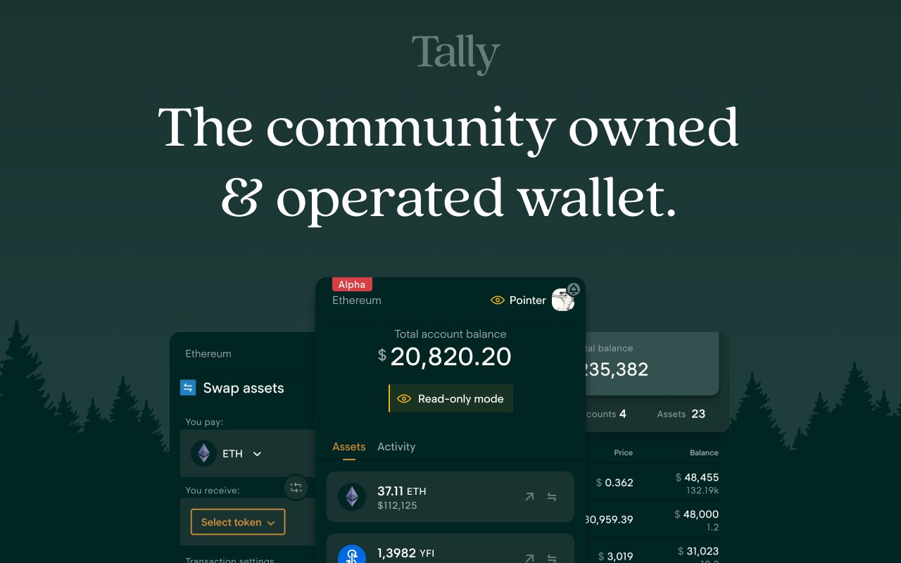

# tally-extension



[Tally Ho](https://blog.tally.cash/a-community-owned-wallet-for-the-new-internet/)
is a community owned and operated Web3 wallet, built as a
[browser extension](https://browserext.github.io/browserext/).

## Why not MetaMask?

Today's Web3 landscape is dominated by a [single wallet](https://metamask.io/)
and a [single infrastructure provider](https://infura.io/), both owned by a
[single conglomerate](https://consensys.net/). These facts undermine the
censorship resistance of Ethereum today... and they're also against Web3's
spirit of community ownership.

We can do better.

Tally Ho will be

- Fairly launched ⚖️
- Sustainably aligned with users 🤲
- Wholly owned by the community 👪

## Quickstart

Try this.

```sh
$ nvm use
$ nvm install
$ npm install -g yarn # if you don't have yarn globally installed
$ yarn install # install all dependencies; rerun with --ignore-scripts if
               # scrypt node-gyp failures prevent the install from completing
$ yarn start # start a continuous webpack build that will auto-update with changes
```

Once the build is running, you can install the extension in your browser of choice:

- [Firefox instructions](https://extensionworkshop.com/documentation/develop/temporary-installation-in-firefox/)
- [Chrome, Brave, Edge, and Opera instructions](https://developer.chrome.com/docs/extensions/mv3/getstarted/#manifest)
  - Note that these instructions are for Chrome, but substituting
    `brave://extensions` or `edge://extensions` or `opera://extensions` for `chrome://extensions`
    depending on browser should get you to the same buttons.

Extension bundles for each browser are in `dist/<browser>`.

By default, the `yarn start` command rebuilds the extension for each browser on
save. You can target a particular browser by specifying it in the command, e.g.
to only rebuild the Firefox extension on change:

```sh
# On change, rebuild the firefox extension but not others.
$ yarn start --config-name firefox
# On change, rebuild the firefox and brave extensions but not others.
$ yarn start --config-name firefox --config-name brave
```

### Note for some Linux distributions

In some Linux distributions such as Ubuntu 20.04, you need to explicitly
tell npm where your `python3` executable is located before running the above
commands successfully:

```sh
$ npm config set python /usr/bin/python3
```

## Package Structure, Build Structure, and Threat Model

The extension is built as two packages, `background` and `ui`. `background`
contains the bulk of the extension's [background script](https://developer.mozilla.org/en-US/docs/Mozilla/Add-ons/WebExtensions/manifest.json/background),
while `ui` contains the code powering extension popups.

These are separate packages in order to emphasize the difference in attack
surface and clearly separate the threat models of each. In particular, `ui`
is considered untrusted code, while `background` is considered trusted code.
Only `background` should interact with key material regularly, while `ui` should
only interact with key material via a carefully maintained API.

The `background` package is also intended to minimize external dependencies
where possible, reducing the surface exposed to a supply chain attack.
Dependencies are generally version-pinned, and `yarn` is used to ensure the
integrity of builds.

## Building and Developing

Builds are designed to be run from the top level of the repository.

### Development Setup

If you’re on macOS, install Homebrew and run `scripts/macos-setup.sh`. Note
that if you don’t have Homebrew or you’re not on macOS, the below information
details what you’ll need. The script additionally sets up pre-commit hooks.

```
$ ./scripts/macos-setup.sh
```

### Validators

If you need to create or update a validation function then:

- You need to write the schema in the `.ts` file to have correct typing.
- Add the new schema with the validator function name to the `generate-validators.ts` file
- You need to update the `jtd-validators.d.ts` or `json-validators.d.ts` files with the typing definition
- run `yarn run generate:validators`
- import it in your code and happy validating :)

This setup is necessary so we don't need to include `unsafe-eval` in the CSP policy.

#### Required Software

If you can't use the macOS setup script, here is the software you'll need to
install:

- `jq`: [Instructions](https://stedolan.github.io/jq/download/)
- `nvm`: [Instructions](https://github.com/nvm-sh/nvm#installing-and-updating)
- `pre-commit`: [Instructions](https://pre-commit.com/#install)

#### Installing pre-commit hooks

Before committing code to this repository or a fork/branch that you intend to
submit for inclusion, please make sure you've installed the pre-commit hooks
by running `pre-commit install`. The macOS setup script does this for you.

#### Local mainnet fork setup for development

For more detailed description see `./dev-utils/local-chain/README.md`

Quick Start:

```
$ cd dev-utils/local-chain
$ yarn install
$ yarn start
```

### Commit signing

Commits on the Tally Ho repository are all required to be signed.
No PR will be merged if it has unsigned commits. See the
[GitHub documentation on commit signing](https://docs.github.com/en/authentication/managing-commit-signature-verification/about-commit-signature-verification)
to get it set up.

### Releasing a version

This repository uses `yarn version` to create new versions. Typical usage:

```sh
$ yarn version --patch # bump patch version, e.g. 0.0.5->0.0.6
$ yarn version --minor # bump minor version, e.g. 0.1.5->0.2.0
```

Major releases generally require more discussion than this automation allows,
but can be managed the same way.

Bumping a version in this way will do a few things:

- Ensure the commit is running on the correct branch (`release-<new-version>`)
  for review. If you are on a different branch, the script attempts to switch
  to a new branch based on the latest origin/main. Releases should generally
  only add version bumps to the main branch.
- Synchronize the extension manifest version to the updated package version.
- Commit, tag, and push the new version and branch.

Once the branch is pushed, you should open a pull request. This will do any
further processing, including potentially managing automated submission of the
new version to extension directories (as relevant).

### Additional Scripts

```sh
$ yarn build # create a production build of the extension
```

The build script will generate a ZIP file for each browser bundle under the
`dist/` directory.

```sh
$ yarn lint # lint all sources in all projects
$ yarn lint-fix # auto-fix any auto-fixable lint issues
$ yarn test # run all tests in all projects

```

#### A note on `git blame`

Because lint configurations can occasionally evolve in a way that hits many
files in the repository at once and obscures the functional blame readout for
files, this repository has a `.git-blame-ignore-revs` file. This file can be
used to run `git blame` while skipping over the revisions it lists, as
described in [the Pro Git book
reference](https://www.git-scm.com/docs/git-blame#Documentation/git-blame.txt---ignore-revs-fileltfilegt)
and [this Moxio blog
post](https://www.moxio.com/blog/43/ignoring-bulk-change-commits-with-git-blame).

To make use of this, you can do one of the following:

- Run `git config --global blame.ignoreRevsFile .git-blame-ignore-revs` to
  configure git to globally look for such a file. The filename is relatively
  standard across projects, so this should save time for other projects that
  use a similar setup.
- Run `git config blame.ignoreRevsFile .git-blame-ignore-revs` to configure
  your local checkout to always ignore these files.
- Add `--ignore-revs-file .git-blame-ignore-revs` to your `git blame`
  invocation to ignore the file one time.

The GitHub UI does not yet ignore these commits, though there is a
[community thread requesting the
feature](https://github.community/t/support-ignore-revs-file-in-githubs-blame-view/3256).
In the meantime, the GitHub blame UI does allow you to zoom to the previous
round of changes on a given line, which relieves much of the annoyance; see
[the GitHub blame docs for
more](https://docs.github.com/en/github/managing-files-in-a-repository/managing-files-on-github/tracking-changes-in-a-file).

## Architecture

Here is a light architecture diagram describing the relationship between
services (in the API package) and the interface and browser notifications:

```
┌─────────────────────────────────────────────────────────────────────────────────────────────────────┐
│                                                                                                     │
│   ____                  _                                                                           │
│  / ___|  ___ _ ____   _(_) ___ ___  ___                                                             │
│  \___ \ / _ \ '__\ \ / / |/ __/ _ \/ __|                                       ┌────────────────────┼──┐
│   ___) |  __/ |   \ V /| | (_|  __/\__ \                                       │                    │  │
│  |____/ \___|_|    \_/ |_|\___\___||___/                                       │                    │  │   ┌─────────────────┐
│                                                                     Chain                           │  │   │External Services│
│                                                                     - Blocks      ━━━━━━━━━━━━┓     │  │   │                 │
│                 ┌────subscribe (incoming or outgoing tx status)───▶ - Transactions            ┃     │  │   │  Local node     │
│                 │                                                                             ┃     │  │   │                 │
│                 │                                                                             ┃     │  │   │  Alchemy        │
│                 │                                                                             ┃     │  ├───▶                 │
│                 │                                                    Indexing                 ┃     │  │   │  BlockNative    │
│                 │                                                    - Accounts               ┃     │  │   │                 │
│                 │                                                    - ERC-20 balances    ━━━━╋─────┼──┘   │  CoinGecko      │
│                 ├───subscribe (eg balance changes), get balances───▶ - ERC-721 ownership      ┃     │      │                 │
│                 │                                                    - Governance proposals   ┃     │      │                 │
│                 │                                                    - On-chain prices        ┃     │      └─────────────────┘
│                 │                                                                             ┃     │
│                 │                                                                             ┃     │      ┌────────────────┐
│                 │                                                   Keyring                   ┃     │      │                │
│                 ├──────list accounts, sign tx, sign message───────▶ - Native  ────────────────╋─────┼──────▶   Extension    │
│                 │                                                   - Remote                  ┃     │      │  Storage API   │
│      ┌──────────┴──────────┐                                                                  ┃     │      │                │
│      │                     │                                                                  ┃     │      └────────────────┘
│      │                     │                                                                  ┃     │
│      │     Wallet API      │──────┐                                 Preferences  ━━━━━━━━━━━━━┫     │
│      │                     │      │                                                           ┃     │      ┌────────────────┐
│      │                     │      │                                                           ┃     │      │                │
│      └──────────▲──────────┘      │                                 Notifications             ┃     │      │                │
│                 │                 │                                 - Ephemeral               ┣━━━━━╋━━━━━━▶   IndexedDB    │
│                 │                 └──────pull and subscribe───────▶ - Application      ━━━━━━━┛     │      │                │
│                 │                                                   - Security-critical             │      │                │
│             subscribe                                                          │                    │      └────────────────┘
│              and get                                                           │                    │
│                 │                                                              │                    │
│                 │                                                            push                   │
│                 │                                                              │                    │
└─────────────────▼──────────────────────────────────────────────────────────────┼────────────────────┘
┌──────────────────────────────────┐                             ┌───────────────▼───────────────┐
│                                  │                             │                               │
│                                  │                             │                               │
│         Wallet interface         │                             │     Browser notifications     │
│                                  │                             │                               │
│                                  │                             │                               │
└──────────────────────────────────┘                             └───────────────────────────────┘
                   ┌───────────────┐
                   │               │
                   │ Internal dApp │
                   │               │
                   └───────────────┘
                   ┌──────┐ ┌──────┐
                   │ Earn │ │ Swap │
                   └──────┘ └──────┘
```

## File Structure

Extension content lives directly under the root directory alongside
project-level configuration and utilities, including GitHub-specific
functionality in `.github`. Extension content should be minimal, and
largely simply glue together UI and wallet code. Manifest information
is managed in the `manifest/` subdirectory as described below.

Here is a light guide to the directory structure:

```
.github/ # GitHub-specific tooling

package.json      # private extension package
webpack.config.js # Webpack build for extension

src/ # extension source files
  background.js # entry file for the background extension script; should be
                # minimal and call in to @tallyho/tally-wallet
  ui.js         # entry file for the frontend UI; should be minimal and bind
                # the functionality in @tallyho/tally-ui

dist/ # output directory for builds
  brave/   # browser-specific
  chrome/  # build
  edge/    # directories
  firefox/
  brave.zip  # browser-specific
  chrome.zip # production
  edge.zip   # bundles
  firefox.zip

build-utils/ # build-related helpers, used in webpack.config.js
  *.js
dev-utils/          # dev-mode helpers for the extension
  extension-reload.js # LiveReload support for the extension.
manifest/         # extension manifest data
  manifest.json             # common manifest data for all browsers
  manifest.chrome.json      # manifest adjustments for Chrome
  manifest.dev.json         # manifest adjustments for dev environment
  manifest.firefox.dev.json # manifest adjustments for Firefox in dev

background/ # @tallyho/tally-background package with trusted wallet core
  package.json

ui/ # @tallyho/tally-ui package
  package.json
```

## Firefox store build

Firefox requires to upload source code if minifier is used and to be able to compile identical output to the uploaded package. Our builds are environment dependent at the moment because of the minification and source map process. Long term solution will be to upgrade our build process to be able to produce identical file assets, but until then we use Docker.

- install and setup docker: https://docs.docker.com/get-docker/
- git clone git@github.com:tallycash/extension.git tallyho-firefox
- cd tallyho-firefox
- git checkout tags/latest_release-tag
- .env.prod: fill in the prod API keys
- `./firefox-build.sh`
- mv firefox.zip ../
- git clean -fdx
- rm -rf .git
- cd ..
- zip -r tallyho-firefox.zip tallyho-firefox

## Localization

Tally currently only support English as the default language. We distil english strings to [\_locales](https://github.com/tallycash/extension/blob/main/ui/_locales/en/messages.json) to prepare for localization.

For other languages, we will use language code defined in [Support locales](https://developer.chrome.com/docs/webstore/i18n/#choosing-locales-to-support). We will use [weblate](https://hosted.weblate.org/projects/tallycash/extension/) for crowd translation, and will commit back to the github periodically after these translations are QA'ed.

<a href="https://hosted.weblate.org/engage/tallycash/">

</a>
